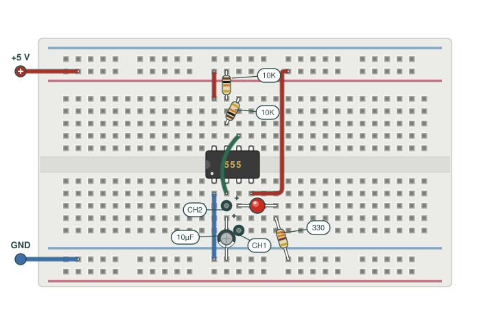
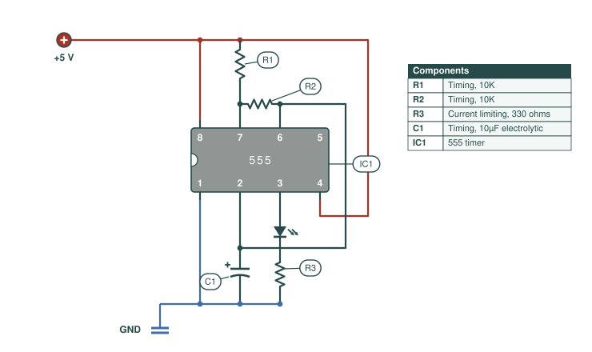
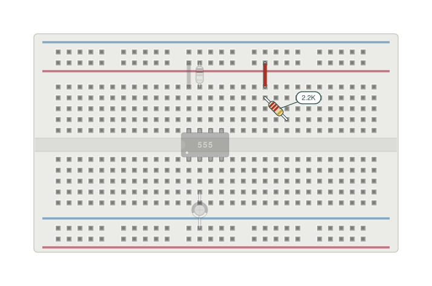

# plattfig

Breadboard and schematic illustrations as code. A single-file,
zero-dependency Python library that renders electronics figures as
standalone SVG, in the visual language of Charles Platt's illustrations
from *Make: Electronics* — flat vector breadboards with colored jumpers
and pill callouts, and semi-physical schematics whose DIP outline
mirrors the breadboard.

> Inspired by, but not affiliated with or endorsed by, Charles Platt,
> Make Community, or O'Reilly Media. If you are learning electronics,
> buy his books; they are wonderful.

## What it draws

**Breadboard figures** ([spec](examples/astable_breadboard.py)):



**Schematic figures** ([spec](examples/astable_schematic.py)) — the IC
keeps its physical pin order so the schematic teaches alongside the
breadboard drawing:



**Staged builds** ([spec](examples/ghost_stage.py)) — the previous
stage renders pale and desaturated, so the new parts carry the color:



## Use

Copy `plattfig.py` next to your figure scripts (it is the whole
library; Python 3.8+, standard library only). One script per figure:

```python
from plattfig import Breadboard, WIRE_RED, WIRE_BLUE, WIRE_GREEN

bb = Breadboard(cols=30)            # half-size board; cols=63 for full
bb.ic(13, "555")                    # DIP straddles the trench, notch left
bb.jumper((13, "a"), ("T+", 13), color=WIRE_RED)
bb.resistor(("T+", 14), (14, "a"), "10k")   # color bands computed from the value
bb.electrolytic((14, "i"), ("B-", 14))      # polarity stripe faces the neg lead
bb.led((15, "h"), (18, "h"))
bb.supply(("T+", 2), "+", label="+5 V", side="left")
bb.save("my-figure.svg")
```

Holes are addressed the way you think about a real board: `(col, row)`
with rows `a`–`e` above the centre trench and `f`–`j` below, or
`('T+'|'T-'|'B+'|'B-', col)` for the power rails. For a DIP placed at
`col`, the top-row pins are 8-7-6-5 left to right, the bottom row
1-2-3-4 (notch left).

The conventions that make the figures read like the book:

- **Wire color is meaning** — red = positive supply, blue = ground,
  yellow/green = signal.
- **Wires lie flat** — `bb.route([...])` runs orthogonal segments with
  rounded corners *around* components (waypoints via
  `bb.xy(col, row)` can sit between holes). A curved hop over a chip
  (`bb.jumper(..., arc=...)`) is for special cases, ideally once per
  figure.
- **Stripped tips** — every wire end shows a bare white tip entering
  its hole; component leads are white with dark outlines.
- **Pill callouts** — `bb.pill("10K", x, y, leader_to=...)` for values,
  `bb.probe(hole, "CH1")` for scope hooks.
- **Ghosting** — `with bb.ghost():` renders a previous build stage
  pale, so incremental figures highlight what changed.

The `Schematic` renderer works on a 10px grid with the same palette:
`sc.dip()` returns pin coordinates to wire against, `sc.wire(points,
role)` with `'pos'`/`'neg'`/`'sig'` roles, `sc.dot()` junctions,
resistors, caps, LED, ground, supply, pills, and a components table.
See [examples/astable_schematic.py](examples/astable_schematic.py).

Check your work by rasterizing and looking:

```bash
qlmanage -t -s 1600 -o /tmp my-figure.svg        # macOS
rsvg-convert -w 1600 my-figure.svg -o check.png  # elsewhere
```

## Use as an agent skill (Claude, GPT, etc.)

[`skills/plattfig/`](skills/plattfig/) packages this library as a
skill: instructions plus a bundled copy of `plattfig.py`, so an agent
can author figures from a plain-English circuit description.

- **Claude Code**: copy the directory into your project:
  `cp -r skills/plattfig .claude/skills/` (or `~/.claude/skills/` for
  all projects). Then ask for a figure, or invoke `/plattfig`.
- **claude.ai**: upload the `skills/plattfig` folder as a custom skill
  (Settings → Capabilities → Skills).
- **GPT / other agents**: paste `skills/plattfig/SKILL.md` into the
  system prompt or project instructions (an `AGENTS.md` pointing at it
  works too) and make `plattfig.py` available in the workspace.

The skill encodes the layout discipline above, so generated figures
come out looking like the examples rather than like clip art.

## License

MIT — see [LICENSE](LICENSE). The illustration *style* it imitates
belongs to the tradition of Make: workbooks; this project just makes
it scriptable.
